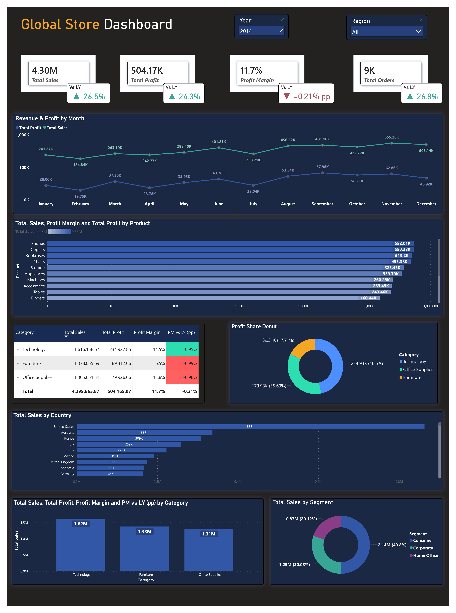

# 📊 Global Superstore Sales Dashboard

> An end-to-end Power BI project analysing 51,290 sales transactions across 7 global markets (FY 2011–2014), demonstrating data modelling, DAX time intelligence, and dashboard design.



---


**[→ View Interactive Dashboard](https://github.com/darkknight3097/global-superstore-dashboard)**

---

## 📌 Project Overview

This project analyses **51,290 sales transactions** from the Global Superstore dataset (FY 2011–2014) across 7 global markets. It covers the full analytics workflow:

- **Data cleaning & modelling** — star schema design in Power BI
- **DAX measures** — KPIs, time intelligence, YoY comparisons
- **Power BI report** — dark-themed, portfolio-grade layout

### Key Business Questions Answered

| Question | Finding |
|---|---|
| How is revenue trending year over year? | +26.3% sales growth in 2014 vs 2013 |
| Which product category is most profitable? | Technology leads at 14.5% margin |
| Why is overall margin shrinking despite sales growth? | Furniture margin dropped -1.04pp; 24.5% of orders lose money |
| Which market drives the most revenue? | APAC ($1.21M, 28% share) — closely followed by EU ($1.04M) |
| Are there seasonal patterns to exploit? | November is peak every year — Q4 accounts for ~35% of annual sales |
| What customer segment should be prioritised? | Consumer (50% of sales) but Corporate is growing fastest |

---

## 📁 Repository Structure

```
global-superstore-dashboard/
│
├── 📋 powerbi/
│   └── Sales Dashboard.pbix          ← PowerBI Semantic model
│
├── 📂 data/
│   └── Global_Superstore2.csv        ← Source dataset (51,290 rows)
│
├── 📸 assets/
│   └── dashboard-preview.png         ← Dashboard screenshot
│
└── README.md
```

---

## 🛠️ Tech Stack

| Tool | Purpose |
|---|---|
| **Power BI Desktop** | Data modelling, DAX measures, report design |
| **DAX** | KPI calculations, time intelligence, YoY comparisons |

---

## 📈 Dashboard Features

### Interactive HTML Dashboard
- **4 KPI cards** — Total Sales, Profit, Margin, Orders with real YoY % change
- **Revenue & Profit line chart** — dual-axis, 12-month trend
- **Sub-category bar chart** — top 15 products ranked by revenue
- **Category performance table** — margin %, inline bars, ±pp vs prior year
- **Profit share donut** — category breakdown
- **Market revenue bars** — all 7 markets (APAC, EU, US, LATAM, EMEA, Africa, Canada)
- **Customer segment donut** — Consumer / Corporate / Home Office split
- **Year filter** — switches all charts between FY 2011, 2012, 2013, 2014 instantly

### Power BI Report
- Dark professional theme
- Star schema data model (Sales + DateTable + Customer + Product)
- Full DAX measure library — 20+ measures including time intelligence
- Conditional formatting for positive/negative indicators

---

## 🔑 Key DAX Measures

```dax
-- Year-over-Year Sales Growth
Sales vs LY % =
DIVIDE(
    [Total Sales] - [Sales LY],
    [Sales LY]
)

-- Prior Year Sales using Date Intelligence
Sales LY =
CALCULATE(
    [Total Sales],
    DATEADD(DateTable[Date], -1, YEAR)
)

-- Profit Margin
Profit Margin =
DIVIDE([Total Profit], [Total Sales])

-- Dynamic KPI Label
Sales vs LY Label =
VAR pct = [Sales vs LY %]
VAR arrow = IF(pct >= 0, "▲ ", "▼ ")
RETURN
    IF(ISBLANK([Sales LY]), "—",
        arrow & FORMAT(ABS(pct), "0.0%") & " vs LY"
    )
```

---

## 📊 Key Insights

### 1. Consistent Growth — but Margin Under Pressure
Revenue grew every year (+18.5% → +27.2% → +26.3%) but profit margin peaked in 2013 at 11.95% and dipped to 11.73% in 2014. Growth is outpacing profitability improvement.

### 2. Technology is the Star, Furniture the Drag
| Category | Sales | Margin | vs LY |
|---|---|---|---|
| Technology | $1.62M | 14.5% | ▲ +0.95pp |
| Office Supplies | $1.31M | 13.8% | ▼ -0.99pp |
| Furniture | $1.38M | 6.5% | ▼ -1.04pp |

Furniture accounts for 32% of sales but only 18% of profit.

### 3. A Discount Problem
**24.5% of all order rows (12,544 of 51,290) have negative profit.** This points to an aggressive discount policy eroding margins, particularly in Furniture and Office Supplies.

### 4. APAC is the Growth Engine
APAC grew from $639K (2011) to $1.21M (2014) — an 89% increase over 4 years, the fastest of any market.

### 5. Q4 Seasonality is Predictable
November is the highest-revenue month every single year without exception. Q4 consistently accounts for ~35% of annual revenue — useful for capacity and inventory planning.

---

---

## 📬 Contact

**[Yayati Chirlikar]**
[LinkedIn →](https://www.linkedin.com/in/yayati-chirlikar/)

---

*Dataset: Global Superstore (public domain, commonly used for BI training and portfolio projects)*
